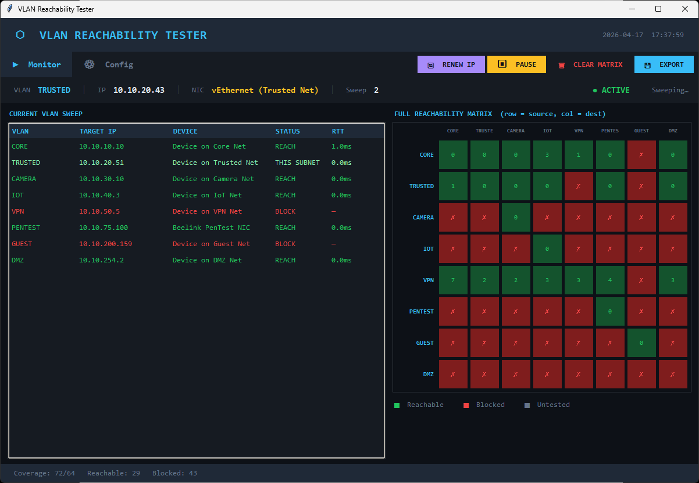
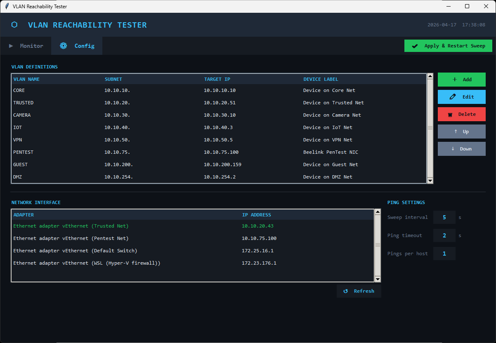

# VLAN Reachability Tester

<p align="center">
  
</p>

Test network reachability across VLANs in real time. Ships as a portable Windows 11 desktop app with a live colour-coded matrix, and as a Linux CLI edition for any Linux system including Raspberry Pi.

<p align="center">
  <a href="https://apps.microsoft.com/detail/9MX63VW05CPF"></a>
  
  
  
</p>

<p align="center">
  If this app is useful to you, a coffee is always appreciated ❤<br><br>
  <a href="https://buymeacoffee.com/stableflux"></a>
</p>

---

## Screenshots


*Monitor tab — live reachability matrix and current sweep status*


*Config tab — VLAN definitions, NIC selection, and ping settings*

---

## Features

- **Live reachability matrix** — colour-coded grid showing reachability between all configured VLANs
- **Matrix cell tooltips** — hover any cell to see last RTT, success rate, and min/avg/max over the last 20 pings
- **Per-sweep status table** — shows current sweep results with RTT, target IP, and device label
- **NIC selection** — bind all testing to a specific network adapter
- **IP renewal** — release and renew DHCP on the selected adapter without leaving the app
- **Persistent results** — matrix retains history across sweeps with a manual clear button
- **Branded PDF reports** — export a professionally formatted report with summary, VLAN definitions, colour-coded matrix, and detailed per-pair results
- **Config import/export** — save and share VLAN configurations between machines as JSON
- **Light / Dark / System themes** — picks up your Windows mode at launch, with a matching native Win11 title bar
- **Window state remembered** — size and position persist across sessions
- **Fully portable** — single `.exe`, no Python installation needed

---

## Download

**Windows** — two options:

- **[Install from the Microsoft Store](https://apps.microsoft.com/detail/9MX63VW05CPF)** — recommended, gets automatic updates
- **[Grab the latest `.exe` from GitHub Releases](https://github.com/StableFlux/vlan-reachability-tester/releases)** — fully portable, no installation

**Linux** — clone the repo or download the `Linux CLI/` folder. See the [Linux CLI Version](#linux-cli-version) section below.

---

## Getting Started

### 1. Run the application
Double-click `VLAN Tester.exe` — no installation needed. On first run a `vlan_config.json` file is created to store your configuration (next to the exe when run standalone, or in `%LOCALAPPDATA%\VLANReachabilityTester\` when installed from the Microsoft Store).

### 2. Configure your VLANs
Click the **Config** tab.

Under **VLAN Definitions**, click **＋ Add** to add each VLAN:

| Field | Description | Example |
|-------|-------------|---------|
| VLAN Name | Short identifier | `TRUSTED` |
| Subnet | Network address (/24) | `10.10.20.0` |
| Target IP | Device to ping on that VLAN | `10.10.20.1` |
| Device Label | Friendly name for the target | `Core Switch` |

Repeat for each VLAN you want to test. Use the **↑ / ↓** buttons to reorder.

### 3. Select your network adapter
Under **Network Interface**, click the adapter you want to use for testing. The selected adapter is highlighted in green. Click **↺ Refresh** if your adapter is not listed.

### 4. Configure ping settings

| Setting | Description | Default |
|---------|-------------|---------|
| Sweep interval | Seconds between full sweeps | `5` |
| Ping timeout | Seconds to wait per ping | `2` |
| Pings per host | Number of pings sent per target | `1` |

### 5. Apply and start
Click **✔ Apply & Restart Sweep** in the tab bar. The app switches to the **Monitor** tab and begins sweeping.

### Importing and exporting configurations
The Config tab also includes **⬇ IMPORT** and **⬆ EXPORT** buttons next to Apply:

- **⬆ EXPORT** — saves the full configuration (VLANs, ping settings, selected NIC) to a JSON file you choose
- **⬇ IMPORT** — loads a previously saved JSON file, confirms before replacing existing VLANs, and applies the new config automatically

Useful for moving configurations between machines or keeping a backup before major changes.

---

## Monitor Tab

### Status bar
Shows your current VLAN, IP address, selected NIC, and sweep count — updated every second even while paused.

### Current VLAN Sweep table
Live results for the current sweep:

| Status | Meaning |
|--------|---------|
| `REACH` | Target is reachable |
| `BLOCK` | Target did not respond |
| `THIS SUBNET` | This is the VLAN your adapter is currently on |
| `???` | Not yet tested this sweep |

### Full Reachability Matrix
Persistent grid showing historical results for every source→destination VLAN pair. Results are retained across sweeps until you click **🗑 CLEAR MATRIX**.

| Colour | Meaning |
|--------|---------|
| Green | Reachable |
| Red | Blocked |
| Grey | Not yet tested |

### Toolbar buttons

| Button | Action |
|--------|--------|
| **⏸ RUNNING / ▶ RESUME** | Green when actively sweeping, yellow when paused — click to toggle |
| **🔄 RENEW IP** | Pauses sweep, runs ipconfig release/renew on selected adapter, waits for new IP |
| **💾 REPORT** | Opens a Save As dialog and generates a branded PDF report of the current results |
| **🗑 CLEAR MATRIX** | Clears the reachability matrix and resets sweep count |

---

## PDF Report

The **💾 REPORT** button generates a professionally formatted PDF containing:

- **Branded header** with the app logo and generation timestamp
- **Summary panel** — current source VLAN, local IP, and sweep statistics
- **VLAN definitions** — full list of every configured VLAN with subnet, target, and device label
- **Reachability matrix** — colour-coded grid with RTT values in reachable cells
- **Detailed results table** — every source→destination pair with status, RTT, and last-tested timestamp
- **Footer** on every page with brand, timestamp, and page number

Ideal for network documentation, change records, or sharing test results with colleagues.

---

## Moving Between VLANs

When you physically move your network connection to a different VLAN (cable change, different Wi-Fi SSID, or switch port reconfiguration):

1. Click **🔄 RENEW IP** — the app pauses the sweep, releases and renews the DHCP lease on your selected adapter, and waits for the new IP
2. Once the new IP appears the status bar updates automatically
3. Click **▶ RESUME** to continue sweeping from the new VLAN

---

## Subnet Format

Subnets are entered as a /24 network address:

| Accepted | Example |
|---------|---------|
| `10.10.20.0` | /24 network |
| `192.168.10.0` | /24 network |

CIDR notation (`/24`) is not required — the app treats the first three octets as the VLAN prefix and ignores the last octet.

---

## Configuration File

Settings are saved automatically to `vlan_config.json`:

- **Standalone `.exe`** — in the same folder as the exe
- **Microsoft Store install** — in `%LOCALAPPDATA%\VLANReachabilityTester\` (the install location under `WindowsApps` is read-only, so user settings are stored in your profile)

Use the in-app **⬆ EXPORT** / **⬇ IMPORT** buttons to move configurations between machines without touching the filesystem.

---

## Building from Source

Requires Python 3.10+ and the following packages:

```bash
pip install pyinstaller reportlab pillow
```

Then either run the full build pipeline (exe + MSIX for Store submission):

```powershell
powershell -ExecutionPolicy Bypass -File build.ps1 -Version 1.2.0.0
```

Or build just the exe:

```bash
pyinstaller --onefile --windowed --name "VLANReachabilityTester" Windows/vlan_tester_gui.py
```

The compiled exe will be in the `dist/` folder.

---

## Linux CLI Version

A terminal-based version for any Linux system (Raspberry Pi, Ubuntu, Debian, Fedora, Arch, Raspberry Pi OS, etc.) is included at `Linux CLI/vlan_tester_cli.py`.

### First run

```bash
sudo python3 "Linux CLI/vlan_tester_cli.py"
```

On the first run an interactive setup wizard walks you through adding your VLANs. Configuration is saved to `vlan_config.json` alongside the script.

### Keys during a sweep

| Key | Action |
|-----|--------|
| `SPACE` | Pause / resume the sweep |
| `c` | Open the in-app config menu (add / remove / edit VLANs, change ping settings) |
| `Ctrl+C` | Quit |

### Re-running the wizard

```bash
sudo python3 "Linux CLI/vlan_tester_cli.py" --setup
```

### Compatibility

The CLI uses standard POSIX modules and is validated on Ubuntu, Debian, Raspberry Pi OS, Fedora, and Arch. It detects system capabilities at startup and fails with clear guidance if something is missing:

- **`ping` not found or lacks `-c`/`-W` flags** (BusyBox/Alpine) — tells you to install `iputils-ping`
- **No permission to send ICMP** — suggests `sudo` or `setcap cap_net_raw+ep $(which ping)`
- **Non-interactive shell** (piped, container, cron) — disables keyboard controls, keeps running with Ctrl+C to stop
- **Local IP detection** cascades through `netifaces`, `hostname -I`, `ip`, `ifconfig`, and `socket` — works even on minimal systems

An example config showing the schema is provided in `Linux CLI/vlan_config.example.json`.

---

## Requirements

**To run the exe:**
- Windows 10 or 11 (64-bit)
- No Python installation needed

**To run from source:**
- Python 3.10+
- `reportlab` (PDF report generation)
- tkinter is included with Python

---

## Support the project

This app is free and open source. If it's saved you some time or helped you debug a tricky VLAN issue, consider buying me a coffee — it keeps the updates coming!

<p align="center">
  <a href="https://buymeacoffee.com/stableflux"></a>
</p>

---

## License

GNU General Public License v3.0 — free to use, modify, and distribute, but any derivative works must also be open source under the same licence. Commercial resale is not permitted.
